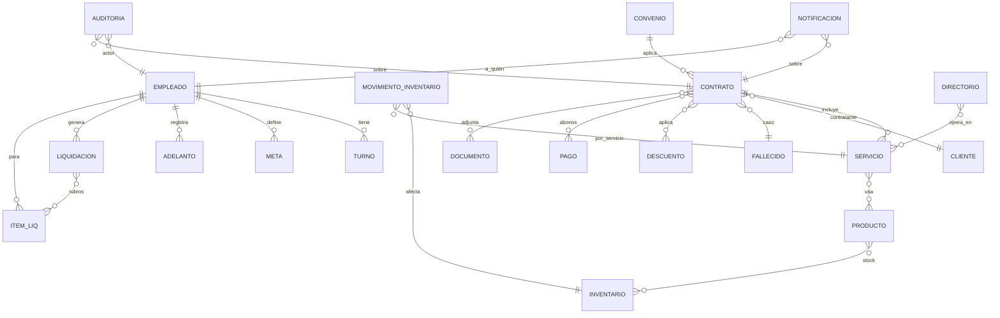
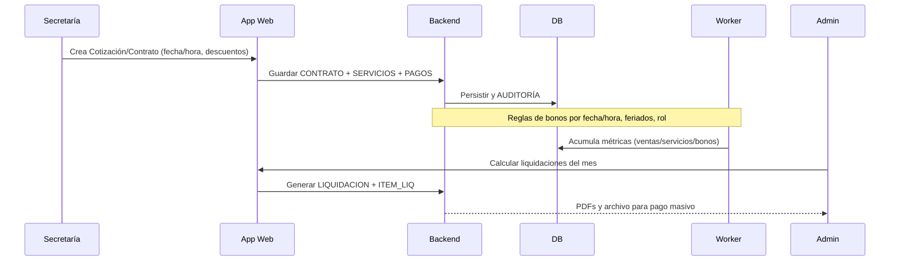
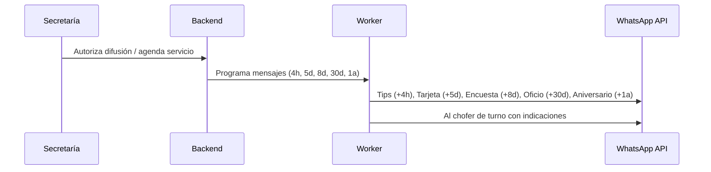

# Sistema de Gestión Funeraria — Esquema Visual

Este documento incluye diagramas (Mermaid) del sistema: arquitectura, modelo de datos y flujos clave. Podés verlos directamente en VS Code con extensiones Mermaid o en GitHub (si soporta rendering) o exportar desde el HTML adjunto.

## Arquitectura (alto nivel)

```mermaid
flowchart LR
    subgraph Usuarios
        D[Dueño]
        A[Administración]
        S[Secretarías]
        C[Choferes]
    end

    D & A & S & C --> UI[App Web (Panel + Formularios)]
    UI --> AUTH[Autenticación + Roles (RBAC)]
    UI --> API[Backend API (Servicios de negocio)]
    API --> DB[(MariaDB/MySQL)]
    API --> STORAGE[(Almacenamiento de archivos S3/MinIO)]
    API --> AUD[Auditoría (eventos y cambios)]
    API <-->|Jobs programados| WORK[Scheduler/Worker]
    API --> WA[WhatsApp Cloud API/Proveedor]
    API --> CONTAB[Integración Contable/ERP/Banco]
    API --> INMEM[Inmemory.cl (API/CSV)]
    WORK --> WA
    WORK --> STORAGE
    DB --> BACKUP[Backups automáticos en la nube]
    STORAGE --> BACKUP
```

## Modelo de datos (simplificado)



## Flujo: Contrato → Liquidación (bonos/comisiones)



## Flujo: Notificaciones (familia y chofer)



---

## Exportar a PDF/JPG

- Opción rápida: abrir `funeral_system_overview.html` en un navegador y:
  - PDF: Imprimir → Guardar como PDF.
  - JPG/PNG: Captura con la herramienta del sistema o extensión.
- VS Code: usar extensión “Markdown PDF” para exportar este `.md`.

## Ideas extra para agilizar gestión

- OCR en facturas (extrae datos y sugiere cuenta contable).
- Conciliación bancaria semi-automática (matching por monto/fecha/nº ref).
- Alertas de anomalías (costos fuera de rango, contratos sin adjuntos).
- Firma digital simple en contratos/autorizaciones.
- PWA para choferes (checklist y evidencia de servicio).
- Presupuestos por rubro con alertas de desvío.
